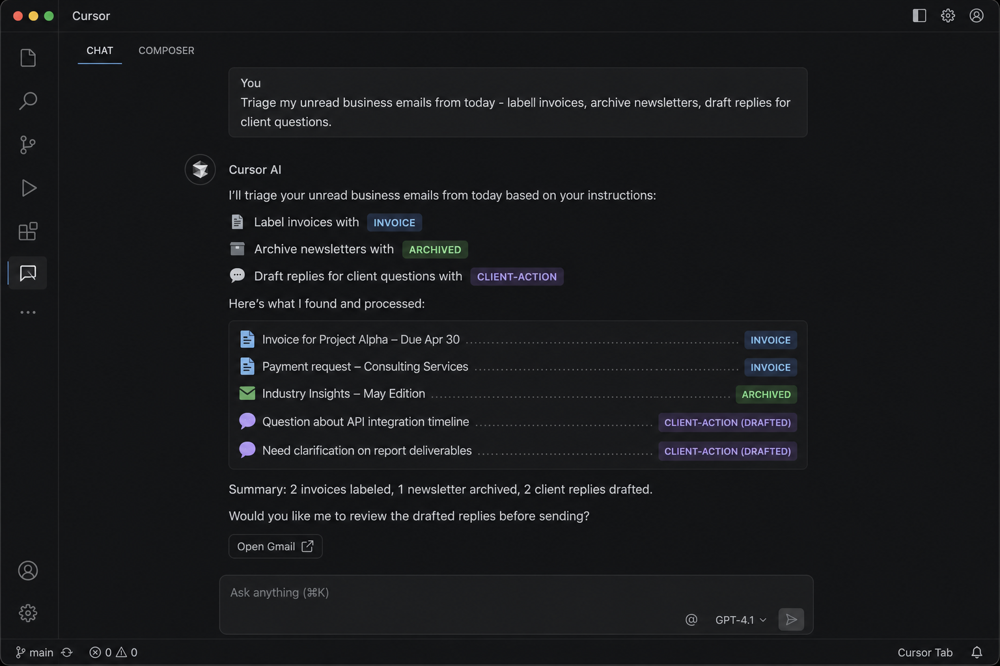
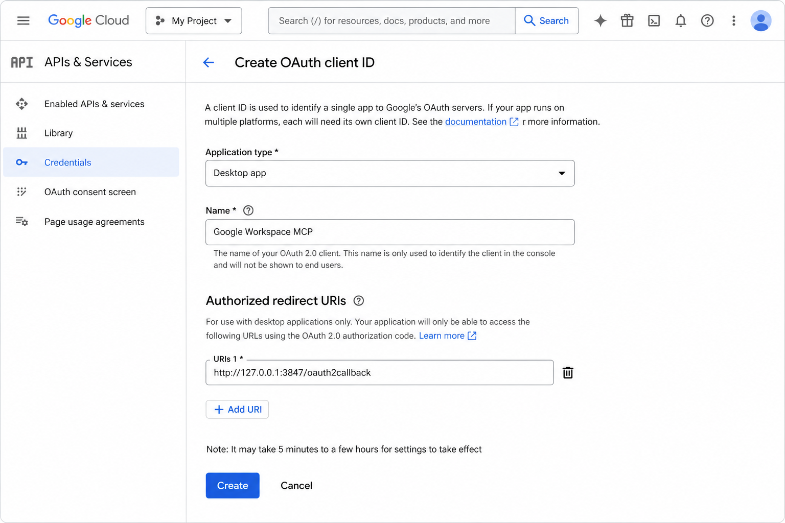
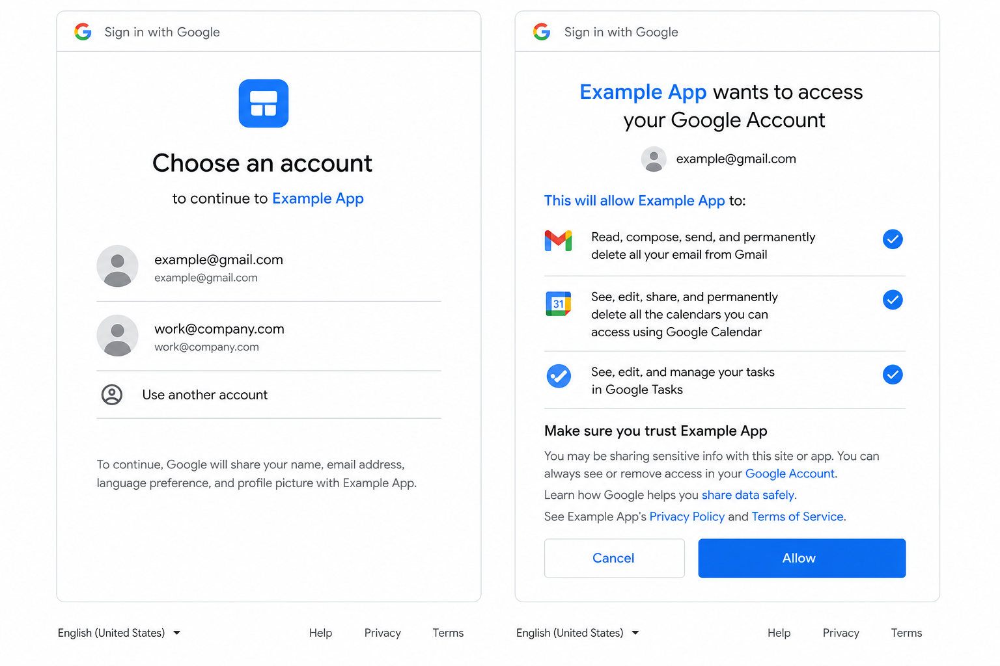
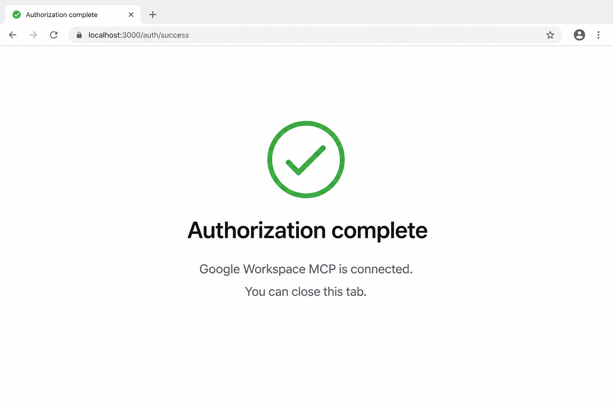
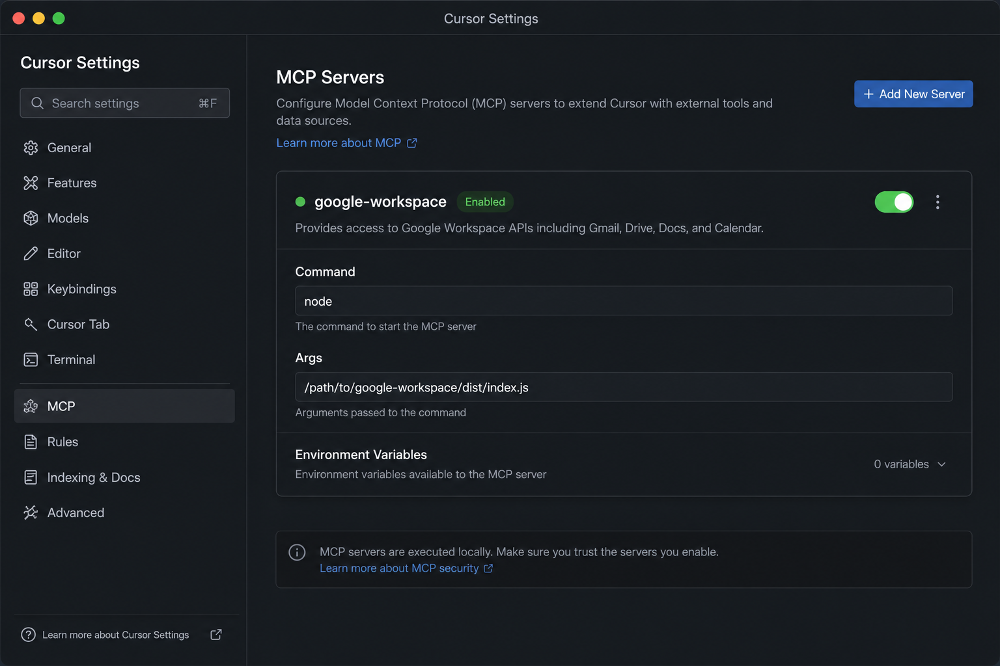

# Google Workspace MCP

An [MCP](https://modelcontextprotocol.io/) server that connects AI assistants (Cursor, Claude Desktop, etc.) to **Gmail**, **Google Calendar**, and **Google Tasks**.

Use it to let an AI agent search and reply to email, create calendar events, and manage task lists — with your own Google OAuth credentials. Nothing in this repo contains secrets; you bring your own Google Cloud project and tokens.



## What you can automate

- **Inbox triage** — label invoices, archive newsletters, flag client mail
- **Replies** — draft or send professional responses in-thread
- **Calendar** — create events from “let’s meet” emails
- **Tasks** — turn action items in mail into Google Tasks
- **Daily/weekly briefings** — unread summary + calendar + open tasks

See **[docs/USE_CASES.md](./docs/USE_CASES.md)** for copy-paste prompts and business workflow templates.

## Tools

| Tool | Description |
|------|-------------|
| `gmail_list_messages` | Search/list Gmail (supports Gmail query syntax) |
| `gmail_get_message` | Read a message by ID |
| `gmail_reply` | Reply (or reply-all) in-thread |
| `gmail_move` | Add/remove labels (archive, trash, etc.) |
| `gmail_list_labels` | List label IDs |
| `calendar_create_event` | Create an event on the primary calendar |
| `calendar_list_upcoming` | List upcoming events |
| `tasks_create` | Create a Google Tasks item |
| `tasks_list` | List open tasks |

## Prerequisites

1. **Node.js 20+**
2. A **Google Cloud project** with these APIs enabled:
   - Gmail API
   - Google Calendar API
   - Google Tasks API
3. **OAuth 2.0 Desktop client** credentials from [Google Cloud Console → Credentials](https://console.cloud.google.com/apis/credentials)

---

## Visual setup guide

### Step 1 — Create OAuth credentials (Google Cloud)

In [Google Cloud Console](https://console.cloud.google.com/apis/credentials), create an **OAuth client ID** → **Desktop app**. Add this redirect URI:

`http://127.0.0.1:3847/oauth2callback`



Copy the **Client ID** and **Client secret** into your `.env` file.

### Step 2 — Sign in and approve access

Run the authorize script (see [Quick start](#quick-start-local--cursor--claude-desktop) below). Your browser opens Google’s sign-in and consent screens:



Approve access for the Google account you want the AI to use (work or dedicated automation account recommended).

### Step 3 — Authorization complete

After you approve, the local callback saves a refresh token to `~/.config/google-workspace-mcp/token.json`:



### Step 4 — Add the MCP server in Cursor

**Cursor Settings → MCP → Add new MCP server** (or edit your MCP JSON). Point `args` at your built `dist/index.js`:



Restart Cursor. You should see `google-workspace` (or your chosen name) with tools listed.

### Step 5 — Automate in chat

Example — business inbox triage with labels:

> Triage my unread business emails from today. Label invoices as `Finance/Invoices`, archive newsletters, and draft replies for client questions. Show a summary table when done.


More prompts: **[docs/USE_CASES.md](./docs/USE_CASES.md)**

---

## Quick start (local — Cursor / Claude Desktop)

### 1. Clone and install

```bash
git clone https://github.com/brandmathco/google-workspace-mcp.git
cd google-workspace-mcp
npm install
npm run build
```

### 2. Configure environment

```bash
cp .env.example .env
```

Edit `.env` and set:

```env
GOOGLE_OAUTH_CLIENT_ID=your-client-id.apps.googleusercontent.com
GOOGLE_OAUTH_CLIENT_SECRET=your-client-secret
GOOGLE_OAUTH_REDIRECT_URI=http://127.0.0.1:3847/oauth2callback
AUTHORIZE_HASH_KEY=choose-a-long-random-string
```

### 3. Authorize Google access

```bash
npm run authorize -- --hash-key=choose-a-long-random-string
```

1. Open the URL printed in your terminal.
2. Sign in and approve (see screenshots above).
3. Refresh token saved to `~/.config/google-workspace-mcp/token.json`.

### 4. Add to Cursor

```json
{
  "mcpServers": {
    "google-workspace": {
      "command": "node",
      "args": ["/absolute/path/to/google-workspace-mcp/dist/index.js"],
      "env": {
        "GOOGLE_OAUTH_CLIENT_ID": "your-client-id.apps.googleusercontent.com",
        "GOOGLE_OAUTH_CLIENT_SECRET": "your-client-secret",
        "GOOGLE_OAUTH_REDIRECT_URI": "http://127.0.0.1:3847/oauth2callback"
      }
    }
  }
}
```

Replace `/absolute/path/to/google-workspace-mcp` with your clone path. Restart Cursor after saving.

### 5. Try it

- *"List my unread Gmail from the last 24 hours"*
- *"Label unread invoices as Finance/Invoices and archive marketing mail"*
- *"Create a calendar event tomorrow at 2pm titled Team sync"*
- *"Add Google Tasks for every unread email that needs a follow-up"*

---

## Business automation examples

| Goal | Example prompt |
|------|----------------|
| Morning triage | *"Summarize unread mail, archive notifications, label client mail Needs-reply"* |
| Invoicing | *"Find emails with 'invoice' or PDF attachments this week, label Finance/Invoices"* |
| Client replies | *"Draft replies for all Needs-reply threads; wait for my OK before sending"* |
| Scheduling | *"Create 30-min calendar holds for meeting requests in unread mail"* |
| Task capture | *"Create Google Tasks from action items in today's unread email"* |
| Weekly review | *"Briefing: unread by label, this week's calendar, overdue tasks"* |

Full templates and Gmail search tips: **[docs/USE_CASES.md](./docs/USE_CASES.md)**

---

## Remote deployment (optional — Fly.io)

Run the HTTP MCP endpoint so Cursor Cloud or other clients can connect over HTTPS instead of stdio.

### 1. Prepare Fly config

```bash
cp fly.toml.example fly.toml
```

Edit `fly.toml` and set `app` to your Fly app name, then:

```bash
fly apps create your-google-workspace-mcp
fly deploy
```

### 2. Set secrets

```bash
fly secrets set \
  GOOGLE_OAUTH_CLIENT_ID="..." \
  GOOGLE_OAUTH_CLIENT_SECRET="..." \
  GOOGLE_OAUTH_REDIRECT_URI="https://your-app.fly.dev/oauth2callback" \
  GOOGLE_REFRESH_TOKEN="..." \
  MCP_API_KEY="your-random-api-key" \
  AUTHORIZE_HASH_KEY="your-random-hash-key"
```

Add `https://your-app.fly.dev/oauth2callback` as an **Authorized redirect URI** in Google Cloud Console.

### 3. Authorize on the remote host

```
https://your-app.fly.dev/authorize?hashKey=YOUR_AUTHORIZE_HASH_KEY
```

Complete Google sign-in in the browser (same consent flow as local setup).

### 4. Connect Cursor to the remote server

```json
{
  "mcpServers": {
    "google-workspace-remote": {
      "url": "https://your-app.fly.dev/mcp",
      "headers": {
        "Authorization": "Bearer YOUR_MCP_API_KEY"
      }
    }
  }
}
```

Health check: `GET https://your-app.fly.dev/health`

---

## Google Workspace (service account) mode

For a **Google Workspace** domain with domain-wide delegation:

```env
GOOGLE_SERVICE_ACCOUNT={"type":"service_account","client_email":"...","private_key":"..."}
GOOGLE_WORKSPACE_USER_EMAIL=you@yourdomain.com
```

Skip OAuth authorize in this mode. Configure delegation in Google Admin and grant the service account the same API scopes listed in `src/auth/googleAuth.ts`.

## Scripts

| Command | Description |
|---------|-------------|
| `npm run build` | Compile TypeScript to `dist/` |
| `npm run dev` | Run stdio MCP locally (tsx) |
| `npm run dev:http` | Run HTTP server locally |
| `npm run authorize -- --hash-key=KEY` | One-time OAuth setup |
| `npm run start` | Run compiled stdio server |
| `npm run start:http` | Run compiled HTTP server |

## Security notes

- **Never commit** `.env`, `token.json`, or OAuth tokens.
- `MCP_API_KEY` protects the remote `/mcp` endpoint; generate a strong random value.
- `AUTHORIZE_HASH_KEY` protects `/authorize`; required for both local `npm run authorize` and remote OAuth.
- OAuth tokens are stored locally at `~/.config/google-workspace-mcp/token.json` by default.
- This server requests modify access to Gmail (`gmail.modify`, `gmail.compose`). Use a dedicated Google account or review scopes before connecting production mail.
- **Review AI-drafted replies** before sending to clients.

## License

MIT — see [LICENSE](./LICENSE).

## Contributing

Issues and PRs welcome at [github.com/brandmathco/google-workspace-mcp](https://github.com/brandmathco/google-workspace-mcp).
